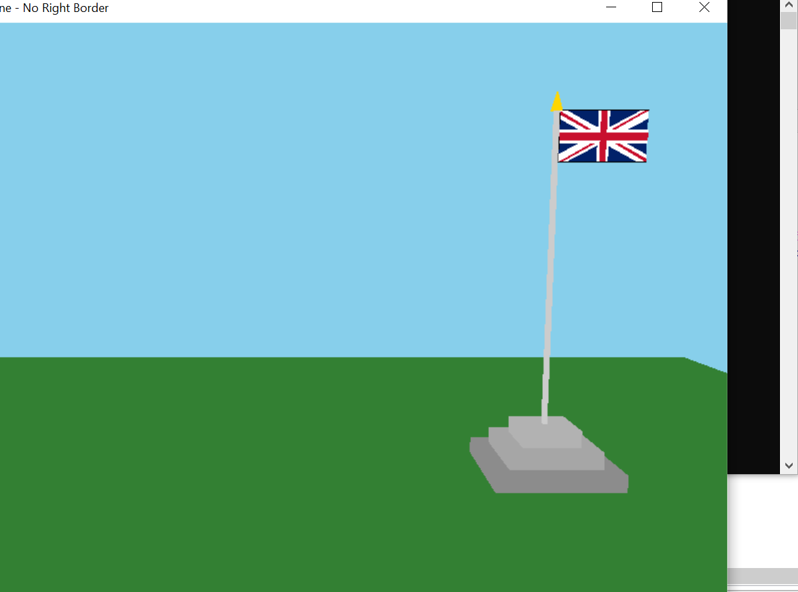
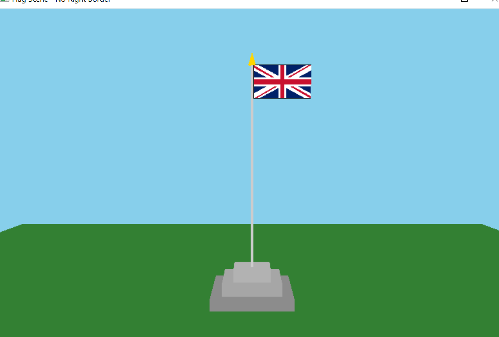
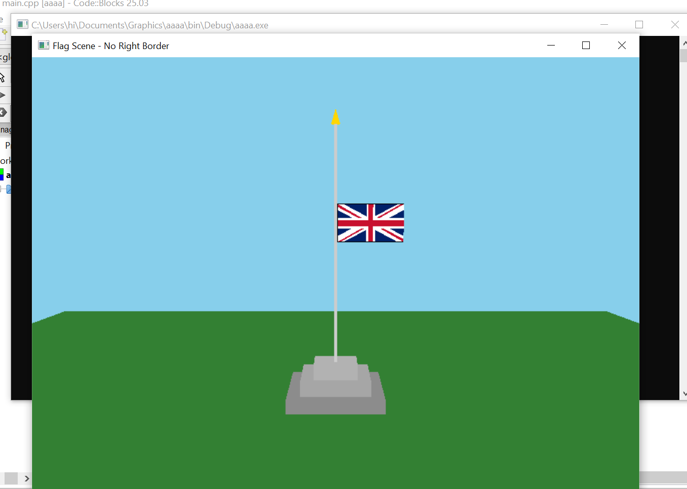
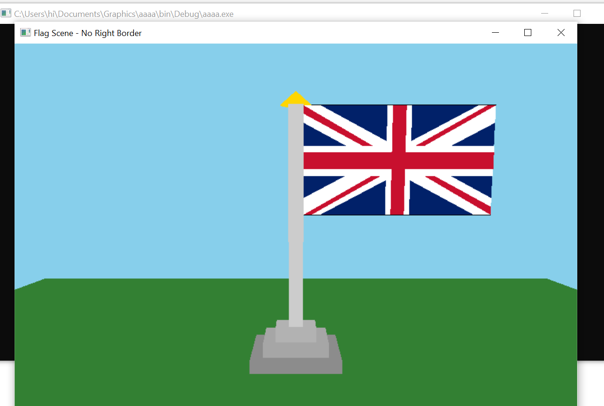
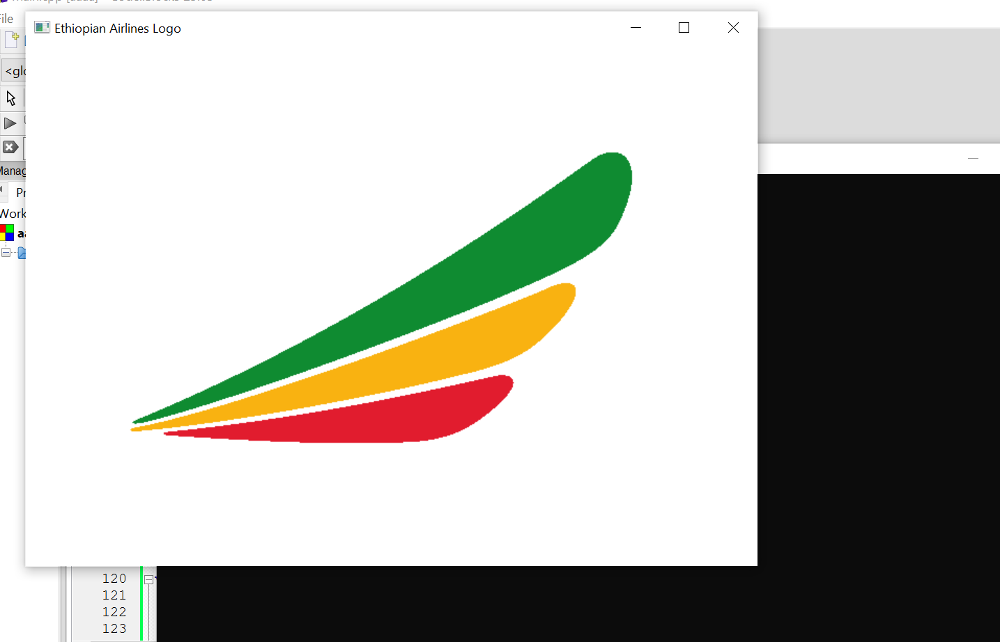
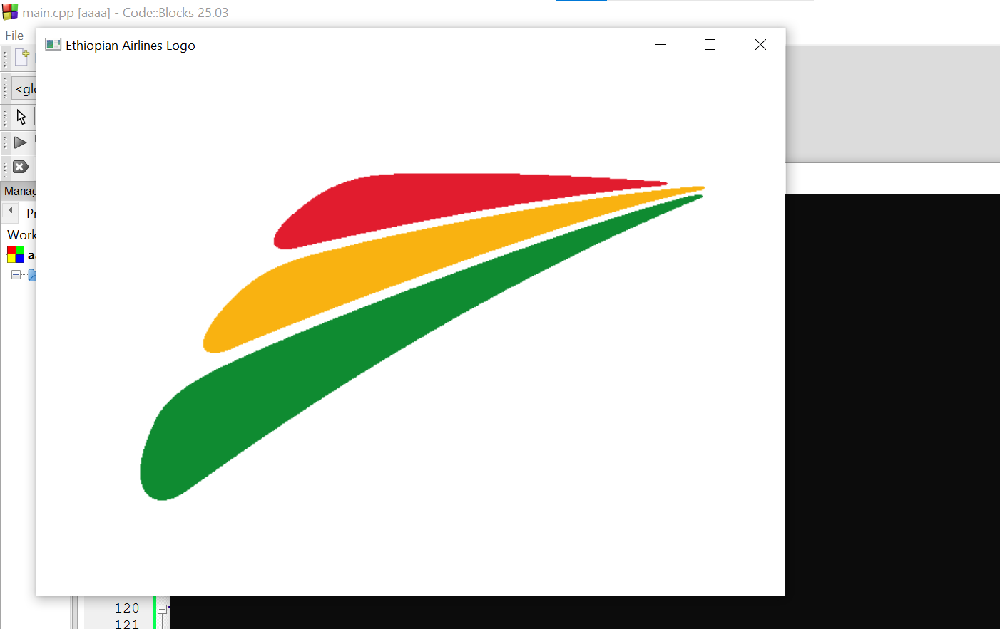
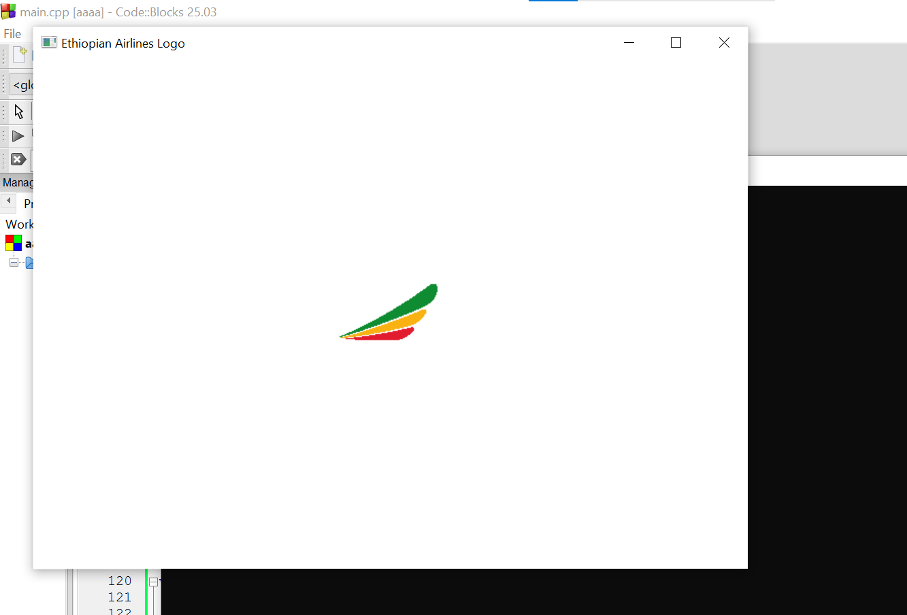
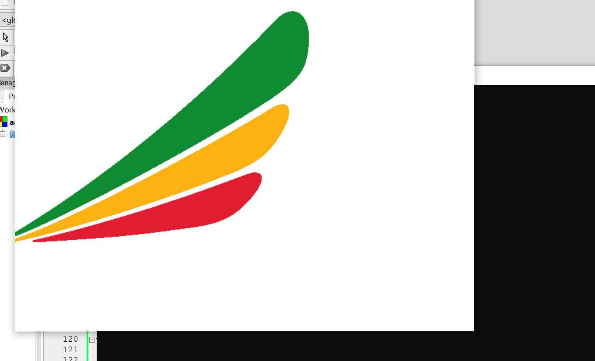

# Graphics Project – Flag & Logo Rendering
## Project Overview
This project demonstrates **computer graphics rendering** using OpenGL/GLUT.
It includes two main parts:
1. **UK Flag Scene** – A 3D flagpole with the Union Jack flag, interactive scaling, translation, and flag raising/lowering.
2. **Ethiopian Airlines Logo** – A tessellated 2D logo built with cubic Bézier curves and colored polygons.
## Features
### 🇬🇧 UK Flag Scene
- **3D Mode:** Flagpole with tiered base, pole, cone finial, and Union Jack flag.
- **Translation:**
- `[R]` → Move pole left
- `[L]` → Move pole right
- **Flag Movement:**
- `[T]` → Raise flag
- `[D]` → Lower flag
- **Scaling:**
- `[+]` → Increase flag and pole size
- `[-]` → Decrease flag and pole size
- **Exit:**
- `[Esc]` → Quit program
### ✈️ Ethiopian Airlines Logo
- **2D Mode:** Logo rendered with tessellation and Bézier curves.
- **Translation:**
- `[W]` → Move logo up
- `[S]` → Move logo down
- `[A]` → Move logo left
- `[D]` → Move logo right
- **Rotation:**
- `[R]` → Rotate logo clockwise (5° increments)
- **Scaling:**
- `[+]` → Increase logo size
- `[-]` → Decrease logo size
## Technical Details
- **Libraries Used:** OpenGL, GLUT, FreeGLUT
- **Rendering Techniques:**
- Tessellation for complex logo shapes
- Bézier curves for smooth outlines
- 3D transformations (translate, scale, rotate)
- **Color Scheme:**
- UK Flag: Red, White, Blue
- Ethiopian Airlines Logo: Green, Yellow, Red
## How to Run
1. Compile with `g++ filename.cpp -lGL -lGLU -lglut`
2. Run the executable.
3. Use the keyboard controls listed above to interact with the scenes.
Sample for Screen Shoot
Sample1                                                   Sample
                 
                  
Screenshot Sample for Logo

               
               

## Conclusion
This project showcases **interactive graphics programming** with OpenGL, combining both **3D flag rendering** and **2D logo tessellation**. It demonstrates transformations (rotation, scaling, translation) and creative use of geometry.
Group  Member
Name                      ID
Ashenafi Guadie                 02130/16
Bezawit Bekele                  01106/16
Hawlet   Hussen                 02850/16
Ruth Mesfin                     01689/16
Sada  Murad                     02912/16
Kalkidan Ayalew                 02775/16

